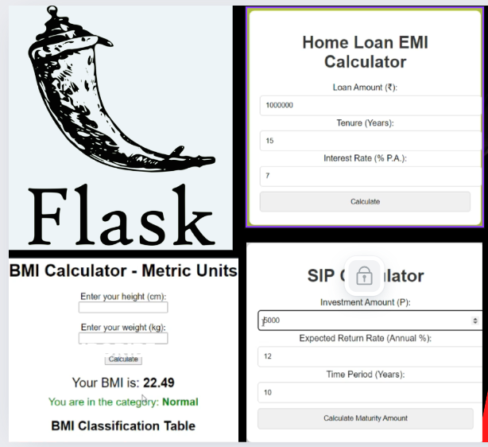

# Flask-Projects

# streamlit-Projects
## Exploring Exciting Projects with Streamlit: Building Interactive Apps


# Table of Contents

- [Overview](#overview)
- [Installation](#Installation)
- [Usage](#Usage)
- [Contribution](#contribution)
- [License](#license)
- [Contact](#contact)

## Overview 

Dive into practical Flask exercises designed to reinforce your understanding of this powerful Python web framework. 
Work through real-world coding challenges that cover routing, forms, templates, and more. 
Perfect for beginners looking to build confidence and enhance their Flask skills.




## Installation

1. Clone this repository to your build machine using:

```bash
  git clone https://github.com/alexvatti/Flask-Projects.git
```
2. Navigate to the project directory:

```bash
  cd Falsk-Projects
```
3. Install the required dependencies using pip:

```bash
  pip install -r requirements.txt
```

## Usage

1. Run the Flask app by executing:
```bash
python.exe  <app.py>
```


2.The web app will open in your browser where you can enter the texts/numbers.

## Contribution

Feel free to contribute and enhance the project!

## License
This project is licensed under the [MIT License](LICENSE).

## Contact
For any inquiries or issues, please contact Alex at alexvatti@gmail.com
